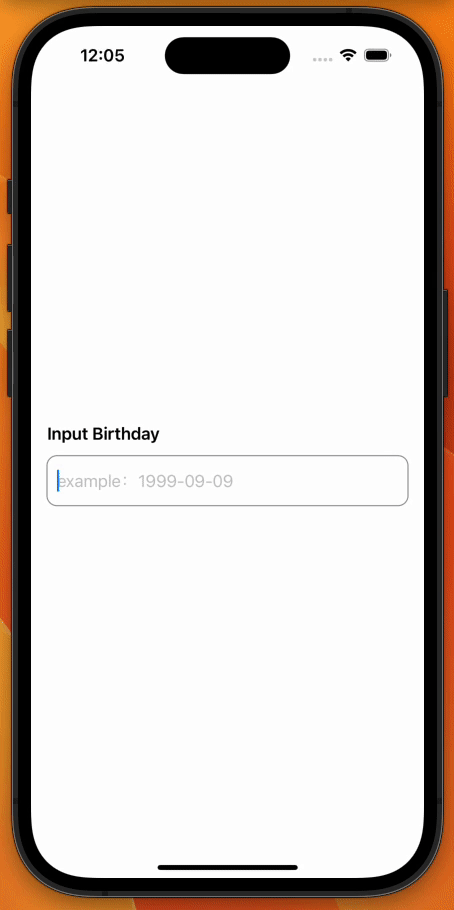

# SwiftUI-Birthday-Input

This is a simple SwiftUI app that allows users to input their birthday in the format of YYYY-MM-DD. Non-digit characters are automatically removed and the input is automatically formatted to match the desired format.

     

## Installation

To run this app, simply clone the repository and run it in Xcode 13 or later.

## Usage

To use the app, simply tap on the text field and input your birthday in the format of YYYY-MM-DD. Non-digit characters will be automatically removed and the input will be automatically formatted to match the desired format.

## License

This app is released under the MIT License. See LICENSE for details.